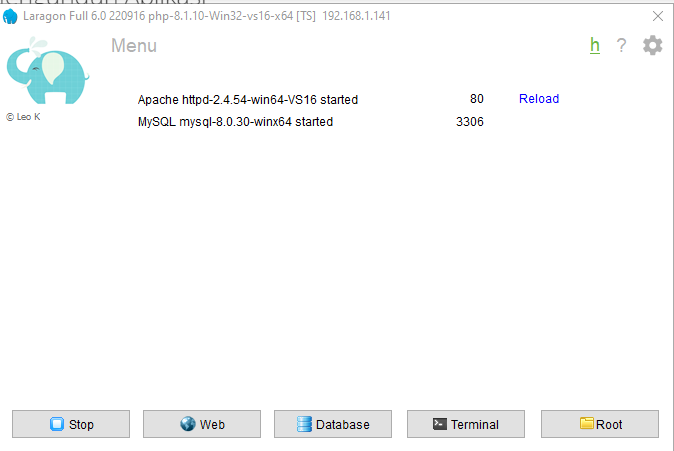
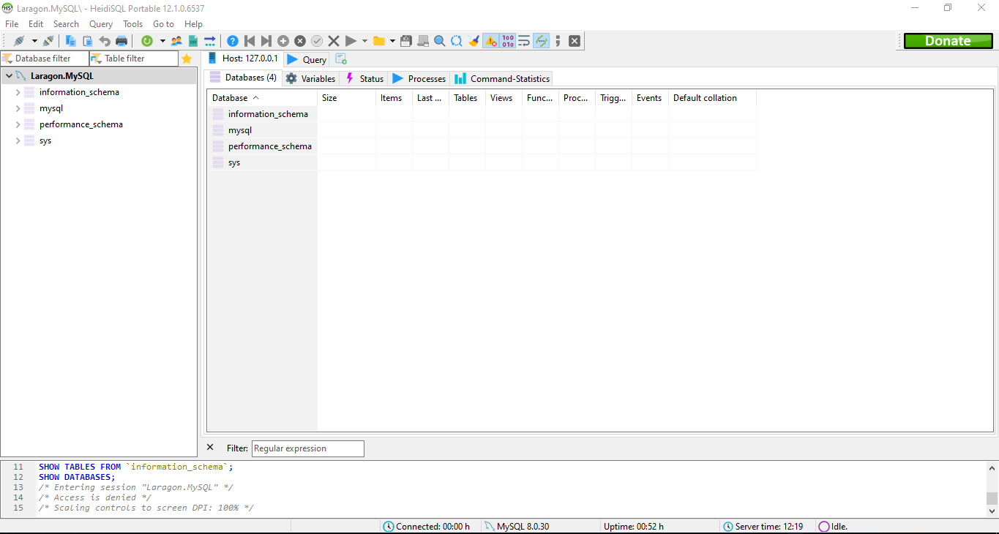

# Instalansi


## Instalansi Aplikasi Server

Seperti yang di ssiggung sebeelumnya, untuk mempermudah proses instalasi kita akan menggunakan aplikasi serverr laragon. ikuti lankah langkah berikut:


1. Kunjungi halaman resmi laragon pada [link berikut](https://laragon.org/)
2. Pada bagian **edition**, klik **Download Laragon - Full (173 MB)**untuk mengunduh aplikasi laragon.
3. Setelah proses dowload selesai, double pada file **laragon-wampp.exe**untuk melakukan installasi.
4. Klik **next** dan **install** sampai seleasai, lalu klik **finish**.
5. Pada jendela aplikasi laragon yangerbuka, klik STARRT ALL untuk menjalankan server web dan data base.
6. Cukup klik tanda ++x++ untuk me-minimize aplikasi laragon. 

## Mengunduh Aplikasi

Untuk mengunduh aplikasi ini lakukan langkah-langkah berikut:

1. Kunjungi halaman release aplikasi pada [link berikut](https://github.com/masipnu/apg/releases/tag/v1.0)
2. unduh kode sumber dalam format ZIP dengan klik `source code (zip)` pada bagian Assets.
3. Anda akan mendapatkan file `apg-1.0.zip`.
4. Ekstrak file tersebut pada direktori `C:\\laragon\www`
5. Anda akan mendapati direktori `apg-01`,silahkan rename menjadi `apg`.

## Instalansi Database

Karena Aplikasi ini bekerja menggunakan database maka kita perlu mengatur databasenya terlebih dahulu sebelum dijalankan.

1. Buka aplikasi laragon.
   
2. klik `database` untuk m,embuka aplikasi manajemen database Heidi SQL.
   
3. Biarkan bagian password (kosong), lalu klik **open**.
   
4. Saat jendela heidi sql terbuka, klik menu `File` > `Run SQL file`,lalu arahkan ke file `apg`.
`sql` yang berada didirektori `C:laragon\www\apg\database` dan klik **Open**.Jika ada peringatan,klik **Yess**.
5. Selama tidak ada pesan `Error`, berarti database sudah tersedia.
6. Tekan tombol ++F5++ pada jendela Heidi SQL untuk me-refesh database,maka anda akan menemukan database `apg` lengkap dengan struktur tabel beserta contoh datanya.
7. Sekarang anda bisa menutup aplikasi Heidi SQL DAN Me-Minimize Laragon.     

## Konfigurasi Aplikasi

Setelah mengatur database,kita perlu melakukan konfigurasi  database pada aplikasi APG.
ikuti langkah-langkah berikut : 

1. Buka file `confige.php` pada direktori `C:/laragon/www/apg/library` dengan teks editor.
   Bisa visual studi code atau Notepade.
2. Atur konfigurasi user dan password database pada baris berikut.  
```php
<?php
$host = "localhost";
$user = "root";
$pass = "";
$db = "apg";

$con = mysqli_connect($host, $user, $pass, $db);

if (mysqli_connect_errno()) {
    echo "Koneksi gagal! : " . mysqli_connect_error();
}
?> 
```
3. Karena pada user root tidak perlu memakai pasword, maka saya rubah `$user = "root";` menjadi ` $user = "";`
4. Cukup ini saja dan Aplikasi Manajemen pegawai siap dijalankan. 