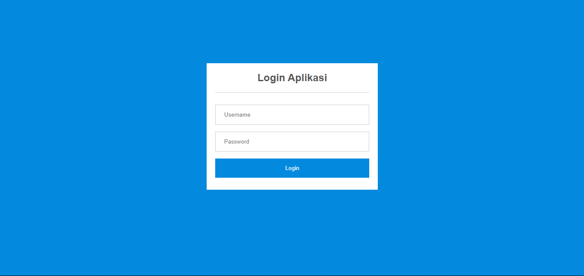
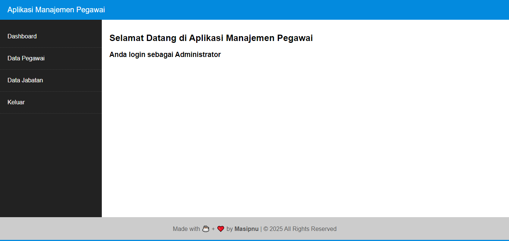

# Panduan Penggunaan

## Login dan Hak Ases 

1. Untuk memulai aplikasi anda bisa membukaa broewser dan memasukkan alamat berikut [http://localhost/apg/login.php](http://localhost/apg/login.php).
2. Muncul  tampilan halaman login.
   
3. Masukkan Username `admin`dan password `admin` untuk login administrator, lalu klik **login**.
4. Selamat anda masuk kehalaman dashboard.
   
 
## Dashboard Utama

## Manajemen Data Jabatan

### Menampilkan Data Jabatan

### Menambah Data Jabatan

### Memperbaharui Data Jabatan 

### Menghapus Data Jabatan

## Manajemen Data Pegawai

### Menampilkan Data Pegawai

### Menambah Data Pegawai

### Memperbaharui Data Pegawai

### Menghapus Data Pegawai